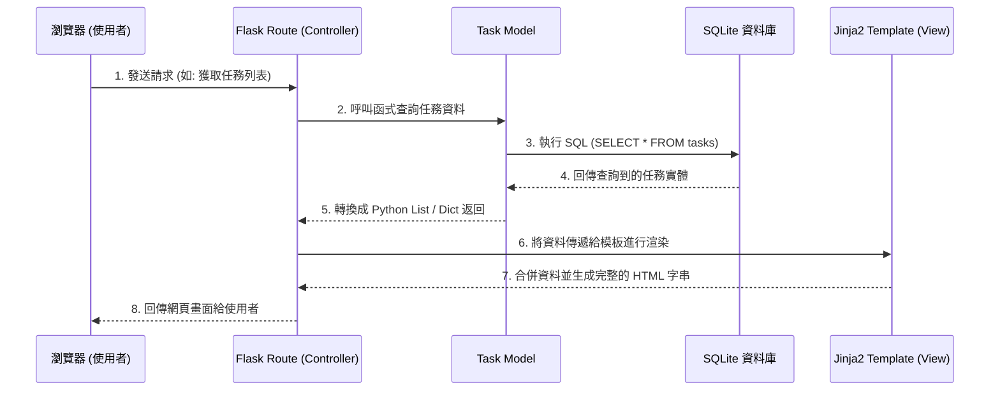

# 任務管理系統：系統架構設計

## 1. 技術架構說明
系統採用常見的 MVC（Model-View-Controller）模式，並且由後端單一整合渲染（無前後端分離模式），確保架構輕量且易於建立與維護。
* **Flask (Controller / 路由)**：作為輕量級 Python Web 框架，接收來自瀏覽器的 HTTP 請求，調用對應的業務邏輯處理，然後將資料傳遞給 View 渲染。
* **Jinja2 (View / 模板)**：Flask 內建的模板引擎，負責結合靜態 HTML 與後端動態資料（如：任務列表），最後產生完整的網頁回傳給使用者。前端將進一步結合 Vanilla CSS 與 JavaScript 實作現代化設計與微動效。
* **SQLite + Python 模組庫 (Model / 資料)**：處理任務的增刪改查邏輯（CRUD），直接與內建的 SQLite 資料庫溝通。

## 2. 專案資料夾結構
為了保持專案架構清晰與高擴充性，系統將核心程式集中於 `app/` 目錄中，啟動入口與配置獨立存放。

```text
web_app_development/
├── docs/                      ← 專案文件目錄 (PRD.md、ARCHITECTURE.md)
├── app/                       ← Web 應用程式主要資料夾
│   ├── models/                ← 資料庫模型 (Model)
│   │   └── task_model.py      ← 定義任務之 CRUD 操作與 SQLite 互動語法
│   ├── routes/                ← Flask 路由 (Controller)
│   │   └── task_routes.py     ← 處理任務的新增、刪除、標記與讀取清單
│   ├── templates/             ← Jinja2 HTML 模板 (View)
│   │   └── index.html         ← 負責顯示所有任務清單及相關操作介面
│   └── static/                ← 靜態資源檔案
│       ├── css/
│       │   └── style.css      ← 處理介面高度客製化與視覺質感設計
│       └── js/
│           └── script.js      ← 負責前端互動功能與微動效呈現
├── instance/                  ← 存放專案運行過程中產生的靜態檔案
│   └── database.db            ← SQLite 實體資料庫備份檔案
├── requirements.txt           ← Python 套件管理與相依清單
└── app.py                     ← 系統的主啟動入口檔案
```

## 3. 元件關係圖
下圖展示了這套系統中各獨立元件處理請求的合作關係。



## 4. 關鍵設計決策
1. **使用 Jinja2 集中渲染代替前後端分離**：考量到此專案目前為 MVP，功能相對集中（新增任務、刪除任務等）。使用前後端不分離的機制可大幅減少 API 設計開銷、省下 CORS 相關處理，提升初期的迭代效率。
2. **視覺主導的 CSS 開發**：為了打造「具現代化的高級質感」並提供微動效回饋（這對使用者長期黏著極其重要），決定由開發者親手管理 Vanilla CSS。而非大量堆疊通用的 Bootstrap 工具類別，確保整體介面能獨樹一格且具細節操作手感。
3. **選擇低維護的 SQLite 作為資料庫**：對於「主要以個人為導向」的任務工具，將資料以單一檔案（database.db）與程式一起帶著走是非常便利的。既不需要額外安裝與啟動 MySQL / Postgres 伺服器，又能輕易達成需求並維持備份的高機動性。
