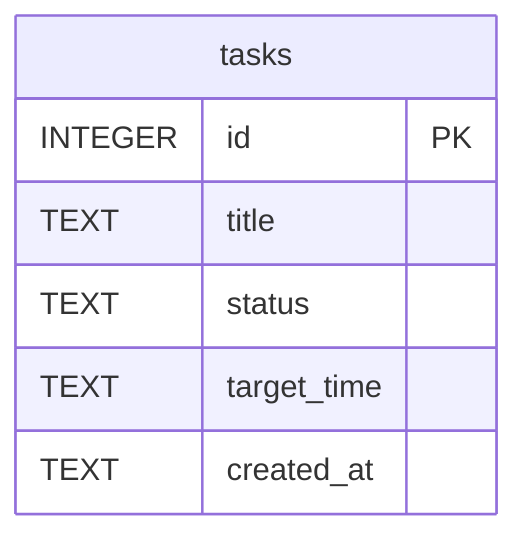

# 任務管理系統：資料庫設計

本文說明專案中的資料庫配置、欄位定義、以及與 Python Model 的相對應規劃，協助後端開發時有一致的資料結構。

## 1. ER 圖（實體關係圖）

目前系統核心圍繞著「任務」進行操作，我們設計出單一集中式資料表 `tasks`。

## 2. 資料表詳細說明

### `tasks` 資料表

負責儲存使用者定義的待辦任務資料。

| 欄位名稱 (Column) | 資料型別 (Type) | 必填 | 預設值 | 說明 |
| :--- | :--- | :---: | :--- | :--- |
| `id` | `INTEGER PRIMARY KEY AUTOINCREMENT` | 是 | *(資料庫自動產生)* | 主鍵，作為任務的唯一識別碼。 |
| `title` | `TEXT` | 是 | | 任務的標題或內容描述。 |
| `status` | `TEXT` | 是 | `'todo'` | 任務的完成狀態，主要使用 `'todo'` (待辦) 與 `'done'` (已完成)。 |
| `target_time` | `TEXT` | 否 | `NULL` | 預定的完成日期 / 時間。以 ISO 字串格式存儲。 |
| `created_at` | `TEXT` | 否 | `CURRENT_TIMESTAMP` | 任務建立的時間戳記。 |

## 3. SQL 建表語法

請參考 `database/schema.sql`，可用於第一次啟動系統時建立資料表結構。

## 4. Python Model 程式碼

根據架構文件與效能簡化原則，我們直接採用 Python 內建的 `sqlite3` 庫進行資料庫連線與指令操作，程式碼實作位於：
`app/models/task_model.py`

其中包含了對 SQLite 的封裝，提供 `create_task`, `get_all_tasks`, `get_task_by_id`, `update_task_status`, `delete_task` 等基礎的 CRUD 函式。
