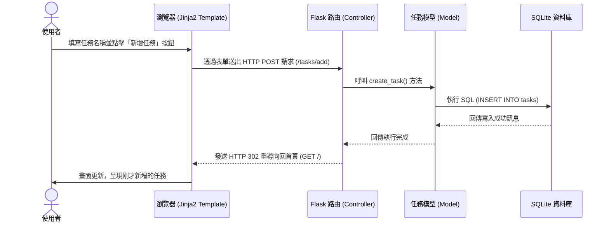

# 任務管理系統：流程圖設計文件

建構在先前的需求規劃 (PRD) 與系統架構設計的基礎上，本文件將系統操作視覺化，以檢視「使用者在網站上的操作邏輯」以及「系統內部的資料流程」。

## 1. 使用者流程圖 (User Flow)

這個流程圖展示了使用者從開啟系統介面開始，可以透過頁面進行的所有主要操作動作循序邏輯。

```mermaid
flowchart LR
    Start([使用者開啟網頁]) --> Home[系統首頁 - 任務清單]
    Home --> Action{要執行什麼操作？}
    
    Action -->|新增任務| Form[在輸入框填寫任務內容並送出]
    Form --> AddProcess[後端儲存並更新狀態]
    AddProcess --> Home
    
    Action -->|篩選任務| Filter[點擊狀態切換 (全部/進行中/已完成)]
    Filter --> FilterProcess[重新讀取列表並過濾顯示]
    FilterProcess --> Home

    Action -->|切換狀態| Toggle[點擊任務旁的核取方塊或完成按鈕]
    Toggle --> ToggleProcess[後端標記任務狀態為「已完成/未完成」]
    ToggleProcess --> Home
    
    Action -->|刪除任務| Delete[點擊任務旁的「刪除」圖示]
    Delete --> DeleteProcess[後端將任務從資料庫中移除]
    DeleteProcess --> Home
```

## 2. 系統序列圖 (Sequence Diagram)

這裡以「**新增一筆任務**」這個核心操作為例，展示了使用者在畫面上點擊送出後，資料如何在我們設計的 MVC 系統元件中層層傳送與確認。



## 3. 功能清單對照表

根據 PRD 需求，以下整理出每個實作功能對應的 URL 路徑 (Endpoint) 與 HTTP 方法。這個表有助於將需求正式落地成為後端路由。

| 用戶操作功能 | HTTP 方法 | URL 路徑 (Endpoint) | 功能詳細說明 |
| :--- | :---: | :--- | :--- |
| **預設顯示任務清單** | `GET` | `/` | 瀏覽首頁。回傳包含所有任務資料庫資料以及 HTML UI 操作介面。 |
| **依狀態篩選清單** | `GET` | `/?filter={status}` | 透過 URL 查詢參數（如 `filter=done`、`filter=todo`）向後端重新抓取對應狀態的清單渲染。 |
| **新增任務** | `POST` | `/tasks/add` | 接收使用者提交的 `title`（任務名稱），存入至 SQLite。處理完成後轉跳回首頁 `/`。 |
| **切換任務完成狀態** | `POST` | `/tasks/<int:id>/toggle` | 更新指定 `id` 任務物件的 `status` 屬性。在以 Jinja2 + HTML 為主的架構下，利用 Form 表單的 POST 方法提交會是最單純的做法。 |
| **刪除特殊任務** | `POST` | `/tasks/<int:id>/delete` | 將 `id` 對應的資料由資料庫內徹底清除。完成後同樣轉跳回首頁 `/`。 |
